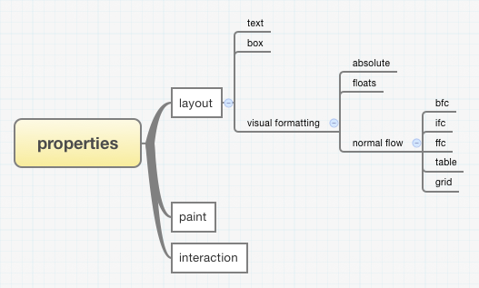

#### 垂直水平居中

css布局分为以下几块：

* 文本布局
* 盒模型box布局
* visual formatting
    * 脱离正常流
        * absolute
        * floats
    * 正常流
        * BFC
        * IFC
        * FFC
        * table
        * grid

所有CSS布局都是围绕以上几块来的，垂直水平居中也是

##### 简单inline or inline-* element （eg：文本、链接）

* 在块级元素中，使用`text-aligin: center;`将行内元素水平居中，使用固定height & line-height 将行内元素垂直居中
* 适用于 inline、inline-block、inline-table、inline-flex等

[DEMO](http://jsbin.sankuai.com/qem/edit?html,css,output)

##### 复杂inline or inline-* element

* 方法一：display: table;

[DEMO](http://jsbin.sankuai.com/nag/edit?html,css,output)

* 方法二：display: flex;

[DEMO](http://jsbin.sankuai.com/pes/edit?html,css,output)

##### 固定width & margin:auto 实现水平居中

* 元素需要固定width
* margin-left 和 margin-right 都为auto

[DEMO](http://jsbin.sankuai.com/cah/edit?html,css,output)

##### 固定宽高，absolute & margin；不固定宽高，absolute & transform

* absolute，top、left设置为50%，margin-top、margin-left设置为-h/2、-w/2，缺点是需要固定宽高
* 使用`transform: translateY(-50%) translateX(-50%);` or `transform: translate(-50%, -50%);`替换margin也可以实现，优点是可以不固定宽高

[DEMO](http://jsbin.sankuai.com/fod/edit?html,css,output)

##### 利用清除浮动

* 原理：在[Collapsing-margins](./CSS_Collapsing-margins.md)中有提到：闭合浮动的元素的border-top会紧贴着相应的浮动元素的margin-bottom，浮动闭合元素的位置与该元素的margin-top无关了，只与响应的浮动元素的margin-bottom的位置有关

[DEMO](http://jsbin.sankuai.com/jot/edit?html,css,output)

参考：

* https://css-tricks.com/centering-css-complete-guide/
* https://www.w3cplus.com/css/vertically-center-content-with-css
